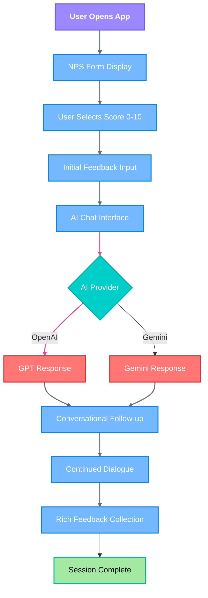
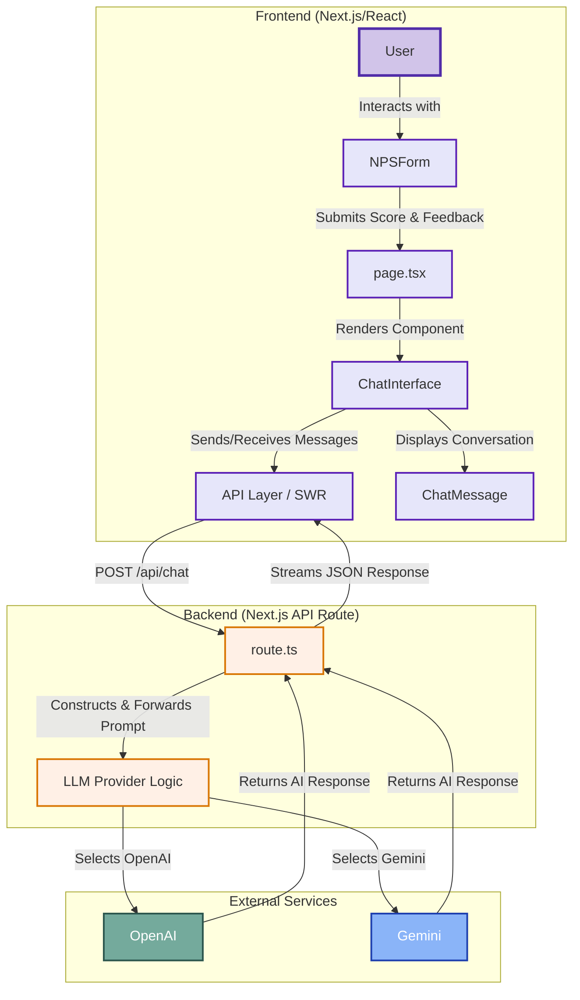

# 🗣️ Conversational NPS Feedback Agent

<div align="center">
  
  
  
  
  
</div>

<div align="center">
  <h3>Transform traditional NPS surveys into engaging AI-powered conversations</h3>
  <p>An interactive feedback collection tool that goes beyond simple ratings to gather meaningful insights through conversational AI.</p>
  
  <a href="https://nps-git-main-rudransh231cs249-5535s-projects.vercel.app">🚀 Live Demo</a> •
  <a href="#getting-started">📖 Documentation</a> •
  <a href="#contributing">🤝 Contributing</a>
</div>

---

## 🌟 Overview

The Conversational NPS Feedback Agent revolutionizes traditional Net Promoter Score surveys by combining the simplicity of NPS scoring with the depth of AI-powered conversations. Instead of leaving users with a single rating, this tool engages them in meaningful dialogue to uncover actionable insights about their experience.

### 🎯 Why This Matters

- **Traditional NPS surveys** provide limited insight beyond a numerical score
- **Our solution** transforms each response into a rich conversation that reveals the "why" behind the score
- **AI-powered follow-ups** adapt to user responses, creating personalized feedback experiences
- **Actionable insights** emerge from natural conversations rather than rigid form fields

---

## ✨ Key Features

### 🎨 **Intuitive User Experience**
- Clean, modern interface with smooth animations
- Mobile-first responsive design
- Accessibility-compliant components
- Progressive loading states

### 🤖 **Smart AI Integration**
- **Adaptive Conversations**: AI tone adjusts based on NPS category (Detractor/Passive/Promoter)
- **Contextual Follow-ups**: Dynamic questioning based on user responses
- **Multi-provider Support**: Switch between OpenAI and Google Gemini seamlessly
- **Streaming Responses**: Real-time AI responses for natural conversation flow

### 🔧 **Developer-Friendly**
- **Modern Tech Stack**: Next.js 14, TypeScript, Tailwind CSS
- **Component Library**: Reusable UI components following shadcn/ui patterns
- **API-First Design**: Clean separation between frontend and backend
- **Easy Configuration**: Simple environment-based setup

### 📊 **Enhanced Feedback Collection**
- **Three-Phase Process**: Initial NPS score → AI conversation → Rich insights
- **Categorized Responses**: Automatic classification of user feedback
- **Conversation History**: Complete interaction tracking
- **Export-Ready Data**: Structured feedback for analysis

---

## 🛠️ Technology Stack

| Category | Technology | Purpose |
|----------|------------|---------|
| **Frontend** | Next.js 14 | React framework with App Router |
| **Language** | TypeScript | Type-safe development |
| **Styling** | Tailwind CSS | Utility-first CSS framework |
| **UI Components** | shadcn/ui | Accessible component library |
| **AI Providers** | OpenAI / Gemini | Large language models |
| **Icons** | Lucide React | Modern icon library |
| **Development** | ESLint, Prettier | Code quality tools |

---

## 🚀 Getting Started

### Prerequisites

Ensure you have the following installed:
- **Node.js** (v18.0 or later) - [Download](https://nodejs.org/)
- **Package Manager** - npm, yarn, or pnpm
- **API Keys** - OpenAI or Google Gemini API key

### Quick Start

1. **Clone and Install**
   ```bash
   git clone https://github.com/your-username/nps-conversational-agent.git
   cd nps-conversational-agent
   npm install
   ```

2. **Configure Environment**
   ```bash
   cp .env.local.example .env.local
   ```
   
   Add your API key to `.env.local`:
   ```env
   # For OpenAI
   OPENAI_API_KEY=your_openai_api_key_here
   
   # For Google Gemini
   GOOGLE_API_KEY=your_google_api_key_here
   ```

3. **Choose Your AI Provider**
   
   Edit `src/app/api/chat/route.ts`:
   ```typescript
   const LLM_PROVIDER: "openai" | "gemini" = "openai"; // or 'gemini'
   ```

4. **Start Development Server**
   ```bash
   npm run dev
   ```
   
   Open [http://localhost:3000](http://localhost:3000) to view the application.

### 🔑 Getting API Keys

#### OpenAI
1. Visit [OpenAI Platform](https://platform.openai.com/)
2. Create an account or sign in
3. Navigate to API Keys section
4. Create a new API key

#### Google Gemini
1. Go to [Google AI Studio](https://aistudio.google.com/)
2. Sign in with your Google account
3. Create a new API key
4. Copy the generated key

---

## 📁 Project Architecture

```
nps-conversational-agent/
├── src/
│   ├── app/                      # Next.js App Router
│   │   ├── api/chat/route.ts    # Chat API endpoint
│   │   ├── globals.css          # Global styles
│   │   ├── layout.tsx           # Root layout
│   │   ├── loading.tsx          # Loading UI
│   │   ├── not-found.tsx        # 404 page
│   │   └── page.tsx             # Home page
│   ├── components/
│   │   ├── ui/                  # Reusable UI components
│   │   │   ├── button.tsx       # Button component
│   │   │   ├── card.tsx         # Card component
│   │   │   ├── input.tsx        # Input component
│   │   │   └── textarea.tsx     # Textarea component
│   │   ├── ChatInterface.tsx    # Main chat component
│   │   ├── ChatMessage.tsx      # Individual message
│   │   └── NPSform.tsx          # NPS scoring form
│   ├── lib/
│   │   └── utils.ts             # Utility functions
│   └── types/
│       └── index.ts             # TypeScript definitions
├── public/                      # Static assets
├── .env.local.example           # Environment template
├── next.config.ts               # Next.js configuration
├── package.json                 # Dependencies
├── tailwind.config.ts           # Tailwind configuration
└── tsconfig.json                # TypeScript configuration
```

---

## 🔄 Application Flow


#NPS CHAT ARCHITECTURE
---

---


## 🔧 Configuration

### Environment Variables

| Variable | Description | Required |
|----------|-------------|----------|
| `OPENAI_API_KEY` | OpenAI API key for GPT models | If using OpenAI |
| `GOOGLE_API_KEY` | Google API key for Gemini | If using Gemini |
| `NODE_ENV` | Environment (development/production) | Auto-set |

### Customization Options

#### AI Provider Configuration
Switch between AI providers in `src/app/api/chat/route.ts`:
```typescript
const LLM_PROVIDER: "openai" | "gemini" = "openai";
```

#### Styling Customization
Modify `tailwind.config.ts` for custom themes:
```typescript
module.exports = {
  theme: {
    extend: {
      colors: {
        // Your custom colors
      }
    }
  }
}
```

---

## 🚀 Deployment

### Vercel (Recommended)
1. Connect your GitHub repository to Vercel
2. Add environment variables in Vercel dashboard
3. Deploy automatically on push

### Other Platforms
- **Netlify**: Configure build settings for Next.js
- **Railway**: Add environment variables and deploy
- **Docker**: Use the included Dockerfile

---

## 📊 Usage Examples

### Basic Implementation
```typescript
// Example of integrating the NPS form
import { NPSForm } from '@/components/NPSform';

export default function App() {
  return (
    <div className="min-h-screen bg-gray-50">
      <NPSForm onSubmit={(score, feedback) => {
        // Handle initial submission
        console.log('NPS Score:', score);
        console.log('Initial Feedback:', feedback);
      }} />
    </div>
  );
}
```

### Custom AI Prompts
Modify AI behavior in `src/app/api/chat/route.ts`:
```typescript
const customPrompt = `
You are a customer feedback specialist. 
Based on the NPS score of ${score}, ask relevant follow-up questions
to understand the customer's experience better.
`;
```

---

## 🤝 Contributing

We welcome contributions from the community! Here's how you can help:

### 🐛 Bug Reports
1. Check existing issues first
2. Use the bug report template
3. Include reproduction steps
4. Add relevant screenshots

### 💡 Feature Requests
1. Search existing feature requests
2. Use the feature request template
3. Explain the use case
4. Provide implementation ideas

### 🔧 Pull Requests
1. Fork the repository
2. Create a feature branch: `git checkout -b feature/amazing-feature`
3. Make your changes
4. Add tests if applicable
5. Update documentation
6. Submit a pull request

### 📋 Development Guidelines
- Follow TypeScript best practices
- Use Tailwind for styling
- Write descriptive commit messages
- Add JSDoc comments for functions
- Ensure responsive design

---

## 📝 Changelog

### v1.0.0 (Current)
- ✅ Initial release
- ✅ OpenAI and Gemini integration
- ✅ Responsive design
- ✅ TypeScript support
- ✅ Component library

### Upcoming Features
- 🔄 Dashboard for feedback analytics
- 🔄 Export functionality
- 🔄 Multiple language support
- 🔄 Advanced AI prompts
- 🔄 Integration APIs

---

## 🆘 Support

### 📚 Documentation
- [Next.js Documentation](https://nextjs.org/docs)
- [Tailwind CSS Documentation](https://tailwindcss.com/docs)
- [OpenAI API Documentation](https://platform.openai.com/docs)
- [Google AI Documentation](https://ai.google.dev/docs)

### 🐛 Issue Reporting
Found a bug or have a question? Please:
1. Check [existing issues](https://github.com/your-username/nps-conversational-agent/issues)
2. Create a new issue with detailed information
3. Include error messages and screenshots

### 💬 Community
- [GitHub Discussions](https://github.com/your-username/nps-conversational-agent/discussions)
- [Discord Community](#) (Coming soon)

---

## 📄 License

This project is licensed under the MIT License - see the [LICENSE](LICENSE) file for details.

---

## 🙏 Acknowledgements

Special thanks to the amazing open-source community:

- **[Next.js Team](https://nextjs.org/)** - For the incredible React framework
- **[Tailwind Labs](https://tailwindcss.com/)** - For the utility-first CSS framework
- **[shadcn](https://ui.shadcn.com/)** - For the beautiful component library
- **[Lucide](https://lucide.dev/)** - For the clean icon system
- **[OpenAI](https://openai.com/)** - For GPT API access
- **[Google](https://ai.google.dev/)** - For Gemini API access

---

<div align="center">
  <p>Made with ❤️ by <a href="https://github.com/your-username">Your Name</a></p>
  <p>⭐ Star this project if you find it helpful!</p>
</div>
